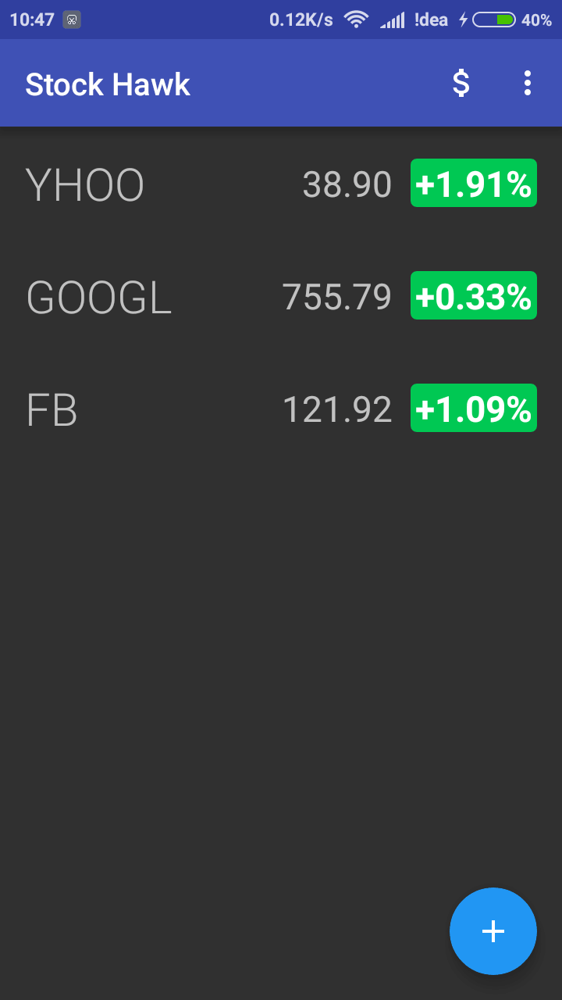
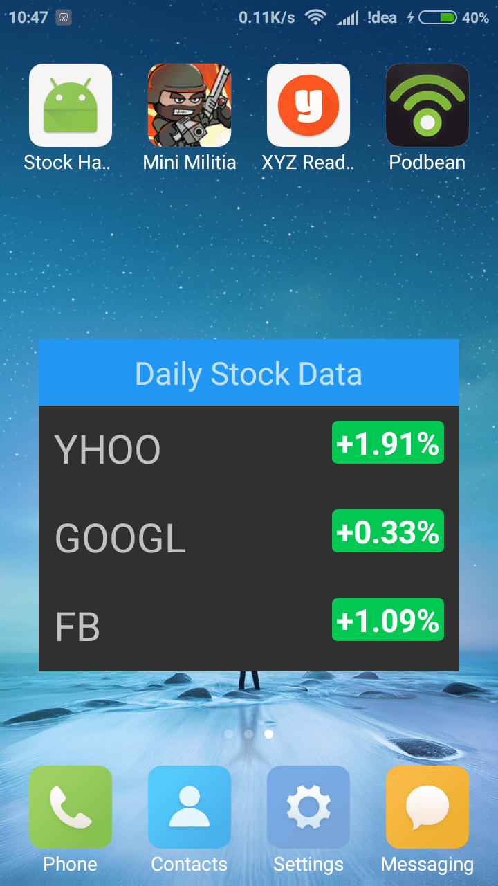

##StockHawkUdacity is Project 3 for Android Nanodegree program

<ul>
	<li> Added accessiblity , making screen reader compatible.</li>
	<li> Localisation and RTL support for languages like arabic. </li>
	<li> Visualisation , Graphs charts on stock prices over specific period of time.</li>
	<li> Widget for viewing data in home screen </li>
	<li> Error case handling , preventing from crashing </li>
	<li> Improved UX / UI by informing data freshness state to user in case of poor network </li>
	</ul>

# Screenshots 

 
## Download APK

